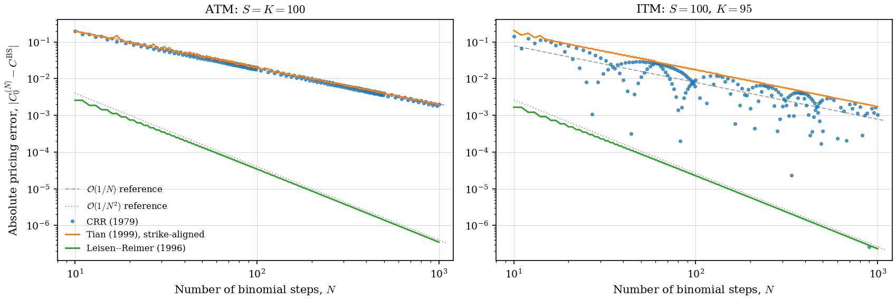
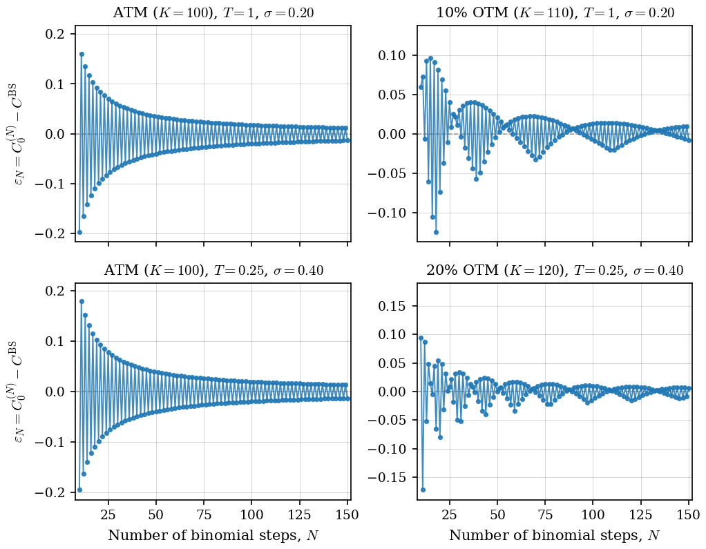
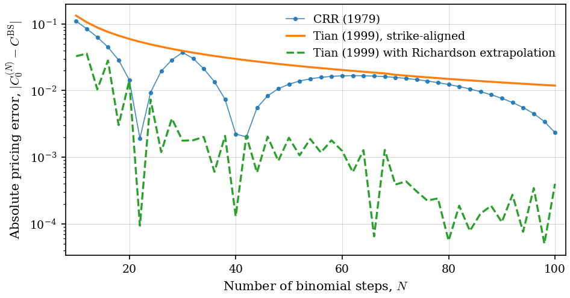
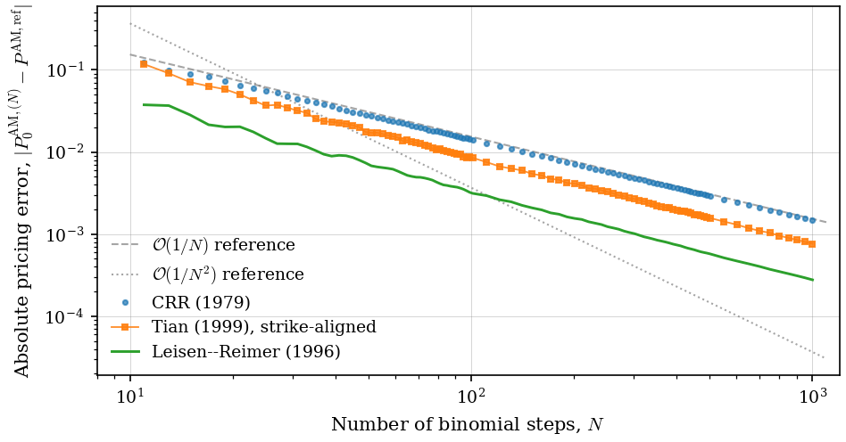

# Option Pricing: Binomial Convergence Schemes

Python implementation of three binomial option pricing schemes — Cox–Ross–Rubinstein (1979), Tian (1999), and Leisen–Reimer (1996) — with numerical convergence analysis against the Black–Scholes benchmark and against published results.

The accompanying mathematical note is in [`note/`](note/); selected handwritten derivations are in [`notes/`](notes/).

## Quick start

```python
from option_pricing.parameterizations import leisen_reimer_parameters
from option_pricing.pricers import binomial_price
from option_pricing.black_scholes import black_scholes_call

# Standard test case: ATM, 1-year, 5% rate, 20% vol
S, K, T, r, sigma = 100.0, 100.0, 1.0, 0.05, 0.20

# Black–Scholes reference
bs_price = black_scholes_call(S=S, K=K, T=T, r=r, sigma=sigma)
# 10.4506

# Leisen–Reimer with 501 steps
params = leisen_reimer_parameters(S=S, K=K, T=T, N=501, r=r, sigma=sigma)
lr_price = binomial_price(
    S=S, K=K, T=T, r=r, N=501, params=params,
    option_type="call", exercise_style="european",
)
# 10.4506 — error of order 1e-5
```

American options use the same `binomial_price` function with `exercise_style="american"`. Implied volatility inversion (Black–Scholes or any binomial scheme) is in `option_pricing.calibration`.

## Headline results

Empirical convergence rates β fitted to log|ε_N| = α − β log N over odd N ∈ [101, 1001], at-the-money European call (S = K = 100, T = 1, r = 0.05, σ = 0.20):

| Scheme              | Empirical β | Theoretical |
|---------------------|-------------|-------------|
| CRR (1979)          | 1.000       | 1           |
| Tian (1999)         | 1.005       | 1           |
| Leisen–Reimer       | 1.995       | 2           |

LR successive-doublings check (N → 2N+1): error ratios 4.01, 4.00, 4.00, 4.00 at N = 101, 201, 401, 801 — confirming β = 2 to two decimal places.

## Convergence behavior

The three schemes converge to the Black–Scholes limit at different rates and with qualitatively different patterns:



CRR (blue scatter) oscillates as N varies — the integer cutoff a_N is misaligned with the strike at most N, and the resulting rounding error propagates into a non-monotone O(1/N) error. Tian (1999) (orange) eliminates this by choosing the tilt parameter λ so that the terminal node (N, j₀) coincides with the strike K exactly; the result is monotone convergence at the same O(1/N) rate. Leisen–Reimer (green) chooses the binomial probability via Peizer–Pratt inversion to match the normal CDF at d_2, achieving O(1/N²) without oscillation.

A subtle point made visible in the right panel: Tian (1999) does *not* outperform CRR per-N. CRR's "lucky-alignment" values of N produce smaller per-N errors than the smooth Tian curve. What strike-alignment buys is **monotonicity, not magnitude** — and monotonicity is what enables Richardson-style extrapolation.

The CRR oscillation is not an artifact: it persists across parameter regimes and is intrinsic to the symmetric tree.



ATM panels (left column) show clean period-2 alternation. OTM panels (right column) show period-2 alternation modulated by a slower beat structure whose period depends on the irrational ratio log(K/S₀) / (2σ√(T/N)) — this is the η_N term in the Diener–Diener (2004) asymptotic expansion.

## What strike-alignment actually delivers

A direct comparison of CRR, Tian (1999), and Tian (1999) with Richardson extrapolation:



Un-extrapolated Tian sits above the CRR scatter at every N (per-N errors are larger). But because Tian's convergence is smooth and monotone, the error ratio ε_N / ε_{2N} converges to ρ = 2, and the Richardson estimate (ρ·C(2N) − C(N)) / (ρ − 1) drops the error by an order of magnitude. CRR cannot use this technique because its oscillation breaks the constant-ratio assumption.

This reproduces the qualitative content of Tian (1999) Figures 2 and 3.

## American options

For American options, no closed-form benchmark exists. Reference prices are computed via Leisen–Reimer at very high N (here N = 25,001, verified stable via Richardson extrapolation):



All three schemes exhibit roughly O(1/N) for American puts. **The Leisen–Reimer rate-2 advantage is European-only**: LR's Peizer–Pratt inversion is calibrated to match the normal tails N(d₁) and N(d₂), and the rate-2 convergence follows from that tail-matching. American option pricing has no closed-form representation in terms of normal CDFs (the early-exercise boundary breaks the reduction), so the tail-matching property has no force. LR retains a constant-factor accuracy advantage but loses its rate advantage.

This is worth flagging because most introductory references treat LR as universally faster than CRR; for American options, that's wrong.

## What's implemented

- **Pricers** (`src/option_pricing/pricers.py`): vectorized backward induction for European and American options on any binomial tree; closed-form CRR cross-check; American exercise-boundary extraction; Richardson extrapolation utility.
- **Parameterizations** (`src/option_pricing/parameterizations.py`): CRR (1979), Tian (1993) third-moment-matching, Tian (1999) flexible binomial with strike-aligned tilt, Leisen–Reimer (1996) via Peizer–Pratt inversion. Each scheme returns a uniform `TreeParameters` dataclass.
- **Black–Scholes benchmark** (`src/option_pricing/black_scholes.py`): closed-form European call/put with continuous dividend yield, plus the d₁, d₂ helpers.
- **Implied volatility calibration** (`src/option_pricing/calibration.py`): Brent inversion against Black–Scholes or any of the four binomial schemes.

## Reproducing every figure and table

```bash
uv sync
uv run pytest                                         # 127 tests
uv run scripts/fit_european_rates.py                  # Table 1
uv run scripts/generate_convergence_three_schemes.py  # Figure 3
uv run scripts/generate_crr_oscillation_regimes.py    # Figure 4
uv run scripts/generate_tian_smoothness.py            # Figure 1
uv run scripts/generate_tian_extrapolation.py         # Figure 2
uv run scripts/generate_american_convergence.py       # Figure 5
uv run scripts/benchmark_runtimes.py                  # Table 2
uv run scripts/generate_social_preview.py             # GitHub social preview
```

All scripts are deterministic; output is byte-identical across runs.

## Verification against published results

The Tian (1999) implementation reproduces 28 numerical values from Tables I and II of Tian's paper to 4–6 decimal places (`tests/test_parameterizations.py::TestTian1999PaperReproduction`). The strike-alignment property — that the terminal node (N, j₀) coincides with the strike K — is verified to machine precision across six (K, N) combinations.

The Richardson extrapolation utility reproduces the worked example from Tian (1999) p. 829: starting from FB prices at N = 50 and N = 100, the extrapolated price has |error| < 5×10⁻⁴, matching Tian's stated figure.

A note on the Tian (1999) implementation: an earlier version of this codebase contained a function labeled `tian_parameters` (presented as Tian 1999) that actually implemented a custom strict strike-aligned solver, not the construction in the paper. This was diagnosed and rewritten in April 2026 to follow Tian (1999) eqs. (6), (11), and (13) directly, with full paper-reproduction tests added. See [`CHANGELOG.md`](CHANGELOG.md) for the full diff.

## Performance

Wall-clock runtime per single European call evaluation, best-of-5 mean (Apple M-series, Python 3.13, NumPy 2.4):

| N     | CRR      | Tian (1999) | LR       |
|-------|----------|-------------|----------|
| 101   | 0.17 ms  | 0.18 ms     | 0.18 ms  |
| 501   | 0.98 ms  | 1.00 ms     | 0.99 ms  |
| 1,001 | 2.18 ms  | 2.21 ms     | 2.19 ms  |
| 5,001 | 17.8 ms  | 17.6 ms     | 17.7 ms  |

All three schemes share the same O(N²) backward-induction inner loop; per-call calibration cost is O(1) and negligible for N ≥ 100. The practical advantage of LR is therefore not in per-step cost but in steps required to reach a given accuracy — at ε = 10⁻⁴, LR needs N ≈ 100 while CRR needs N ≈ 10,000.

## Methodology and provenance

The mathematical content of the accompanying note is the author's own; complete handwritten derivations for the key results — one-period replication, the closed-form CRR formula, CRR parameter asymptotics, the mean and variance of Z_N, the Lindeberg–Feller verification, binomial tail convergence, stock-numeraire convergence, and the oscillation mechanism — are available in [`notes/CRR_Handwritten_Derivations.pdf`](notes/CRR_Handwritten_Derivations.pdf). AI-assisted tools were used for prose polish, LaTeX typesetting, and figure-script structure; numerical results, code architecture, and mathematical reasoning are the author's.

## Project structure

```
option-pricing/
├── src/option_pricing/   # core library
├── scripts/              # figure and table generation
├── tests/                # 127 tests, including 28 paper-reproduction tests
├── note/                 # typeset mathematical note (.tex + .pdf)
├── notes/                # handwritten derivations
├── figures/              # generated PDFs and PNGs
└── CHANGELOG.md
```

## Planned extensions

- Empirical SPX calibration on OptionMetrics / WRDS option data (Phase 3).
- Local volatility implied trees in the spirit of Derman–Kani (1994) and Rubinstein (1994).
- Heston (1993) stochastic volatility calibration via Carr–Madan (1999) FFT.

## References

Cox, J. C., Ross, S. A., and Rubinstein, M. (1979). *Option Pricing: A Simplified Approach.* Journal of Financial Economics 7(3), 229–263.

Diener, F. and Diener, M. (2004). *Asymptotics of the price oscillations of a European call option in a tree model.* Mathematical Finance 14(2), 271–293.

Leisen, D. P. J. and Reimer, M. (1996). *Binomial Models for Option Valuation — Examining and Improving Convergence.* Applied Mathematical Finance 3(4), 319–346.

Tian, Y. (1999). *A Flexible Binomial Option Pricing Model.* Journal of Futures Markets 19(7), 817–843.

## License

MIT. See [`LICENSE`](LICENSE).

---

David Dávila — University of New Mexico — [github.com/daviddavilad](https://github.com/daviddavilad)